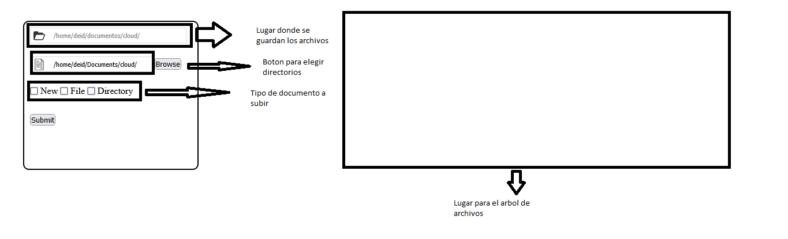
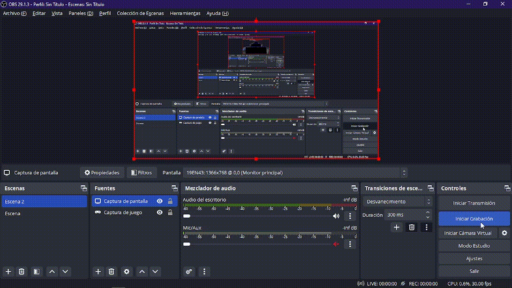

# HOME-CLOUD

## Introducción

Bienvenidos a la documentación de mi proyecto de almacenamiento en la nube personal, desarrollado como parte de el proyecto Final en el curso de Sistemas Operativos. Este proyecto combina una variedad de tecnologías y conocimientos para crear una plataforma de almacenamiento en la nube personal y segura que puede ser implementada y personalizada por cualquier usuario.
## Objetivo del Proyecto

El objetivo principal de este proyecto es construir una solución de almacenamiento en la nube personal que permita a los usuarios almacenar, gestionar y acceder a sus archivos de manera segura y conveniente. 

## Tecnologías Clave

Para lograr nuestro objetivo, hemos empleado una combinación de tecnologías en el backend y el frontend:

- **Backend:** Utilizamos Node.js para manejar la lógica de ejecucion  Además, he incorporado C para las operaciones de almacenamiento.

- **Frontend:** Hemos desarrollado la interfaz de usuario utilizando HTML y tecnologías web estándar. Esto garantiza una experiencia de usuario sencilla y accesible desde cualquier navegador web moderno.

## Requisitos Previos

### NodeJS
Para la instalacion hay que seguir los siguientes links, en Windows solo en necesario descargar el instalador.
- En [Windows](https://nodejs.org/en/download)
- En distribuciones [Linux](https://nodejs.org/en/download)
- En [Mac OS](https://gist.github.com/tomysmile/da3cb8194ec8f0e4df86)

## Instalación
### 
[En desarrollo]
### Ejecutar el archivo c
En el arhivo principal de home-cloud
``` bash
$ cd back && gcc -o ../hc hc.c && cd ..
```
## Funcionamiento FronEnd

[En desarrollo]


## Funcionamiento BackEnd

[En fases finales] En el siguiente GIF se puede ver la creacion de una carpeta a travez de un GET de la URL. Donde primero se crea un servidor de host tiene el 'localhost' y el puerto 8080.


### Funcionamiento del archivo "hc.c"

[Ya terminado] Se desarrollo un CLI para el manejo de datos directamente, como la creacion de la carpeta main y todo lo que puede hacer el servidor relativamente.(Video corto por lo del GIF).
